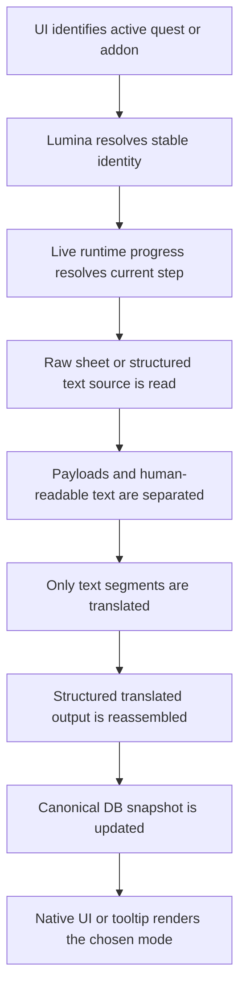

# Echoglossian Refactor Conversation History

## Purpose

This document is a condensed chronological archive of the ongoing refactor conversation for Echoglossian.

It is not a verbatim transcript. It exists as a durable memory of the important decisions, observations, and architectural changes that were made during the work on quest handling, payload preservation, tooltips, Lumina-based sheet acquisition, and DB normalization.

If this archive ever diverges from the current code, the code and the focused technical docs should take precedence.

## Maintenance Rule

Treat this as a living document.

After each meaningful milestone in the conversation, append a short, high-signal update here that captures:

- what changed
- why it changed
- what new evidence or decision it produced
- what the next likely step is

Keep updates concise. This document should stay useful as a memory aid, not become a full raw transcript.

## High-Level Outcome

The conversation converged on a few strong conclusions:

- quest data should not be treated as UI text alone
- the UI is useful for identifying the active quest and current visible surface, but not as the authoritative source of quest content
- stable quest identity should come from Lumina and quest sheet identifiers
- live quest progress should come from native runtime state such as `QuestManager` and director todo data
- structured text must preserve payloads, placeholders, and formatting
- quests, item tooltips, and action tooltips should share the same payload-aware logic
- the quest database should store canonical, versioned quest snapshots instead of fragmented UI snapshots

## Chronological Summary

### 1. MiniTalk stabilization and multi-overlay reasoning

The work began with `_MiniTalk`.

The key findings were:

- the addon has multiple simultaneous instances
- the overlay must follow the visible bubble, not a single global text source
- a bubble that is not in the viewport does not need an injected overlay
- the correct approach is to key overlays by bubble instance and update them frame by frame only while visible

This established an important pattern for future dense UI work:

- follow the addon instance, not a raw node id
- avoid forcing overlay insertion when the addon is off-screen
- keep translation state separate from visual attachment

### 2. CutSceneSelectString probing and list rendering

The next focus was `CutSceneSelectString`.

The debugging process confirmed:

- the addon exposes a title/question plus multiple options
- the tooltip overlay should render one item per line
- the quest-like selection UI is better handled as a structured list, not a single blob of text

The probe work also confirmed that the addon can have multiple options and that any implementation must be prepared for more than two choices.

### 3. Journal and quest hover behavior

The Journal family became a major focus:

- `Journal`
- `JournalDetail`
- `JournalAccept`
- `JournalResult`
- `ToDoList`
- `RecommendList`
- `ScenarioTree`
- `AreaMap`

Important observations from the logs and probing:

- the quest title portion of Journal was generally more stable
- the body of `JournalDetail` was hard to hit with a small trigger area
- `ToDoList`, `RecommendList`, and `ScenarioTree` were initially not producing hover hits consistently
- tooltip behavior should be per-addon and not inherit global toggle effects unintentionally
- some modes were mutating native UI when tooltip-only behavior was intended

The work led to a stronger distinction between:

- reading quest data
- choosing whether to show translation in the native UI
- choosing whether to show translation in tooltip only
- choosing whether to show original text in tooltip when swap is enabled

### 4. JournalDetail trigger and tooltip body

We settled on using the `JournalCanvasComponentNode` with node id `14` as the preferred trigger for the Journal quest body hover.

The goal was:

- keep the quest title stable
- let the body hover cover the correct visual region
- show the full quest body in the tooltip
- rely less on the tiny title/body text bounds

This was still considered a compromise because the UI was not always the right source of truth for the body text.

### 5. Quest sheet acquisition through Lumina

The project then shifted toward a sheet-first quest pipeline.

The key realization was:

- `Quest.RowId` is not the same as the quest text sheet identifier
- `Quest.Id` is the textual quest sheet identifier used to mount the quest text sheet
- live quest progress comes from runtime quest state, not from the visible Journal text

That led to a reusable pipeline documented separately and reinforced through the quest probe:

- resolve the quest through Lumina
- mount the correct raw quest sheet from `Quest.Id`
- preserve structured text rather than flattening it too early
- combine the sheet with live quest progress
- use the result as the canonical quest snapshot

This was later validated against external sources:

- Lumina
- Lumina.Excel
- Lumina docs
- QuestShare
- EXDViewer
- HaselDebug
- `exd.camora.dev`

### 6. QuestPlate schema redesign

The live SQLite database showed that the old `questplates` table was fragmented:

- many rows per quest
- no meaningful `QuestId` population in the historical data
- no `GameVersion` column in the old shape
- quest content often split across partial step snapshots

The new canonical direction became:

- one logical row per quest identity and translation context
- keyed by `QuestId + TranslationLang + TranslationEngine + GameVersion`
- updated as the quest advances
- no reliance on `RowVersion` for meaning

The old `RowVersion` field was removed from `QuestPlate`, because it was not contributing to a reliable persistence model in SQLite.

### 7. Structured payload handling

Another central insight was that quest text, item tooltips, and action tooltips should not be treated as plain strings.

The shared rule became:

- preserve payload structure
- translate only human-readable text segments
- reassemble the output with payload order intact
- never flatten away formatting and placeholders unless the feature is intentionally lossy

This was formalized as a reusable structured text pipeline for:

- quests
- `ItemTooltip`
- `ActionTooltip`
- `StringArrayData`

### 8. Tooltips, hover logs, and log hygiene

Hover-based debugging became important, but logs had to be kept under control.

The work uncovered that:

- some tooltip-related logs were emitted far too often even without hover
- some Journal and ToDoList paths were still mixing content capture with native mutation
- some hover triggers were too small or too inconsistent

The rule that emerged was:

- logs should show the minimum needed to understand whether hover registered and which target was selected
- do not log full translated text in hot paths
- suppress repeated per-frame chatter once the issue is understood

### 9. Translation queue pacing and rate-limit protection

The first-load stutter problem exposed that too many quest-related translations could fire at once.

The queue/broker layer was therefore used to:

- serialize translation work
- suppress duplicate in-flight translations
- avoid hammering the translation backend
- reduce the risk of rate limiting

### 10. Command docs and probe tooling

To keep the workflow reproducible, documentation was added for:

- `/eglo`
- `/eglodbmanager`
- `/egloaddonprobe`
- `/egloquestprobe`

The quest probe was especially important because it showed:

- the quest row in Lumina
- the quest text sheet path
- the live todo/progress state
- the current DB row

This helped prove that the old quest data shape was too sparse and that the new quest pipeline was needed.

### 11. Refactor documentation as memory

Several docs were created to serve as long-term memory for the refactor:

- `docs/refactor-timeline-and-flow-analysis.md`
- `docs/quest-sheet-acquisition-pipeline.md`
- `docs/journal-quest-data-model-and-flow.md`
- `docs/structured-text-payload-pipeline.md`
- `docs/quest-probe-command.md`
- `docs/commands/README.md`

These docs are meant to remain useful even after the code evolves, because they explain the intended flow and the reasoning behind it.

## Current Working Model

The current design intent can be summarized like this:



## Working Agreements Reached During the Conversation

- Quest UI should be used as a capture surface, not as the long-term source of truth.
- Quest identity should be stable and sheet-driven.
- Live progress should come from the director/quest manager state.
- Quest text should preserve payload structure.
- Item and action tooltips should eventually follow the same payload-aware pattern.
- Hover mode and native mutation mode must remain separate.
- Per-addon behavior should not leak into unrelated addons through a global toggle.
- Logs should stay narrow and actionable.
- The DB should store canonical, versioned quest snapshots, not fragmented UI-only slices.

## Notes For Future Work

- Keep using the quest probe whenever a quest shape looks suspicious.
- Prefer sheet-first capture whenever the sheet identity is known.
- Use the UI only to disambiguate what is currently visible.
- Continue treating payload handling as a shared pipeline, not a one-off quest workaround.
- If the quest DB shape still proves too narrow, redesign it from the sheet/progress model rather than extending the old UI snapshot model.

## Related Reference Docs

- [Quest Sheet Acquisition Pipeline](./quest-sheet-acquisition-pipeline.md)
- [Structured Text Payload Pipeline](./structured-text-payload-pipeline.md)
- [Journal Quest Data Model and Flow](./journal-quest-data-model-and-flow.md)
- [Quest Probe Command](./quest-probe-command.md)
- [Refactor Timeline and Flow Analysis](./refactor-timeline-and-flow-analysis.md)

---

## Milestone — scripts/quest-reader created and verified (April 2026)

### What changed

- **`scripts/quest-reader/quest-reader.csproj`** and **`scripts/quest-reader/Program.cs`** were created.
  This is a standalone .NET 10 console project that reads FFXIV game data using the exact same Lumina DLLs used by Dalamud at runtime (`%APPDATA%\XIVLauncher\addon\Hooks\dev\`).
- **`AGENTS.md`** was updated to add SaintCoinach (https://github.com/xivapi/SaintCoinach) to the References section as a fallback for offline scripts where Dalamud is not available.

### Why it was added

The prior work used in-game probe output from log files to understand quest sheet structure.
The script replaces that manual approach — it reads the live game files offline, using `Lumina.GameData`, so the full structured quest text sheet can be inspected without running the game.

This was needed to answer design questions about the quest pipeline:

- Which row types does a quest text sheet actually contain?
- What is the current gap between sheet data and what `QuestProgressResolver` reads?
- What should `QuestPlate` store to represent the full structured payload?

### Evidence confirmed by the script

The script was verified against two quests from prior log probes:

**Strange Bedfellows** (`RowId=69929`, `InternalId=AktKmb114_04393`, `Sheet=quest/043/AktKmb114_04393`):

- 122 total rows
- **1 SEQ** — journal summary shown in `JournalDetail` body
- **8 TODO** — active objectives shown in `ToDoList` / `ScenarioTree`
- **1 SYSTEM** — cinematic caption
- **73 DIALOG** — NPC/character dialog lines

**The Paths We Walk** (`RowId=67011`, `InternalId=HeaVnz025_01475`, `Sheet=quest/014/HeaVnz025_01475`):

- 130 total rows
- **10 SEQ** rows (one per journal phase), **8 TODO** rows (padded to 24 empty slots)
- **4 SYSTEM** rows, **~85 DIALOG** rows

### Row classification rule (confirmed)

| Key pattern           | Type   | Shown where                              |
|-----------------------|--------|------------------------------------------|
| `_SEQ_NN`             | SEQ    | JournalDetail body (per quest phase)     |
| `_TODO_NN`            | TODO   | ToDoList, ScenarioTree objectives        |
| `_SYSTEM_NNN_NNN`     | SYSTEM | Cinematic captions                       |
| `NPC_NAME_NNN_NNN`    | DIALOG | NPC/character dialog lines               |
| empty value           | EMPTY  | Padding slots (safe to skip)             |

### Gaps confirmed in the current implementation

- `QuestProgressResolver.ReadQuestStepTexts()` filters for `_TODO_` rows **only** — SEQ, SYSTEM, and DIALOG rows are never read or stored.
- `QuestPlate.ObjectivesAsText` and `QuestPlate.SummariesAsText` are **always empty** in the DB (confirmed from log probe db output: `objectives=0 summaries=0`).
- `QuestPlate.OriginalQuestMessage` holds visible UI body text, not the sheet-sourced SEQ summary.
- There is no field in `QuestPlate` for SEQ rows, SYSTEM rows, or DIALOG rows.

### Technical notes

- Lumina requires the `sqpack/` subdirectory as the constructor path, not the parent `game/` directory. The script normalizes any supplied path automatically.
- `LuminaOptions { PanicOnSheetChecksumMismatch = false }` is required for offline use.
- Quest sheet path is derived from `Quest.Id.ExtractText()` (the internal textual key), **not** from `Quest.RowId`. Formula: `quest/{internalId[-5..-3]}/{internalId}`.
- SaintCoinach was considered but is not needed — the Lumina DLLs from Dalamud are sufficient and are already installed locally.

### Script usage reference

```powershell
cd scripts/quest-reader
dotnet run -- --quest "Strange Bedfellows"
dotnet run -- --quest-id 67011 --lang en --all-rows
dotnet run -- --sheet quest/014/HeaVnz025_01475 --json output.json
dotnet run -- --game-dir "D:\FFXIV\game" --quest "The Paths We Walk"
```

### Next steps

1. Write `docs/quest-full-pipeline-design.md` — full design doc covering sheet acquisition → row classification → translation per type (SEQ/TODO/SYSTEM separately; DIALOG optional) → DB save → display routing per addon.
2. Redesign `QuestPlate` model: add `QuestTextSheetName`, `SeqRowsAsText`, `SystemRowsAsText`, `DialogRowsAsText`; rename `ObjectivesAsText` to `TodoRowsAsText` for clarity.
3. Add the EF Core migration for the redesigned model (additive, nullable new fields).
4. Update `QuestProgressResolver.ReadQuestStepTexts()` to also collect SEQ and SYSTEM rows.

---

## Milestone — quest-reader validated; ScenarioTree documented (April 12, 2026)

### What changed

- **`scripts/quest-reader/Program.cs`** — added `--scenario-tree` probe mode.
  Probes the typed `ScenarioTree` Excel sheet and cross-references each row's
  `RowId` against the Quest sheet to show the quest name, internal ID, and text sheet path.
  Optionally filter to a single quest with `--quest-id`. Includes property reflection
  dump of `RowOffset`, `Name`, `Addon`, `QuestChapter`, `Type`, and unknown fields.
- **`docs/quest-full-pipeline-design.md`** — prepended a new **ScenarioTree Sheet** section
  documenting the confirmed sheet structure and its implications for the plugin.

### Validation runs

All runs used `--game-dir` default (Steam path) with `Language.English`.

**Coming to Gridania** (`RowId=65575`, `InternalId=ManFst001_00039`):
- 90 rows — 3 SEQ, 1 TODO, 5 SYSTEM, ~50 DIALOG
- Confirms early ARR quests follow the same row classification pattern.

**Strange Bedfellows** (`RowId=69929`) — re-confirmed:
- 122 rows — 1 SEQ, 8 TODO, 1 SYSTEM, 73 DIALOG

**The Paths We Walk** (`RowId=67011`) — re-confirmed:
- 130 rows — 10 SEQ, 8 TODO, 4 SYSTEM, ~85 DIALOG

### ScenarioTree confirmed facts

- `ScenarioTree.RowId == Quest.RowId` — **direct join**, no string matching needed.
- Total rows: **1,044** — only main-scenario and listed side-story quests.
- "The Paths We Walk" (`RowId=67011`) has **no** ScenarioTree entry.
- "Strange Bedfellows" (`RowId=69929`) **does** have a ScenarioTree entry:
  `RowOffset=46518`, `Name=T_VER600_02_14`, `Type→ScenarioType`, chapter/addon refs.
- The in-game `ScenarioTree` addon renders the active TODO row for each listed quest.
- Chapter header text comes from `ScenarioTree.Addon` (a second translation surface if needed).

### Implications captured in the design doc

- When `ScenarioTree` addon is open, quest can be identified by `RowId` directly.
- Overlay should render the active `TODO row` from `QuestProgressSnapshot.QuestSteps`.
- `Addon` field is a separate translation target for the scenario chapter header if wanted.

### Next steps

These remain from the previous milestone:
1. Write `docs/quest-full-pipeline-design.md` — ✅ done (includes ScenarioTree section now).
2. Redesign `QuestPlate` model — ✅ done.
3. Add EF Core migration — ✅ done.
4. Update `QuestProgressResolver.ReadQuestStepTexts()` — ✅ done (now `ReadQuestTextRows`, returns SEQ + TODO + SYSTEM).

**New — pending implementation:**
- Hook ScenarioTree addon handler to use `ScenarioTree.RowId` for quest identity lookup.
- Route SEQ rows to `JournalDetail` overlay.
- Route active TODO row to `ScenarioTree` addon overlay.

---

## Milestone — content-hash smart retranslation detection (April 12, 2026)

### Goal

Avoid retranslating quest text on every game update when the actual quest content
hasn't changed. Instead: detect whether the source text has changed by comparing
a content fingerprint, and if unchanged, only bump the stored `GameVersion` in-place.

### What was done

**New file: `NativeUI/Helpers/QuestContentHash.cs`**
- Static helper `QuestContentHash.Compute(seqRows, todoRows, systemRows)`
- Sorts all `{key}={value}` pairs from SEQ + TODO + SYSTEM rows, UTF-8-encodes them,
  SHA256-hashes them, and returns the first 8 bytes as a 16-char lowercase hex string.
- Stable fingerprint: same quest content → same hash across game versions.

**`NativeUI/Helpers/QuestProgressResolver.cs`**
- `QuestProgressSnapshot` gained a new `ContentHash` string parameter (8th field).
- `TryResolveQuestProgress` computes the hash via `QuestContentHash.Compute()` before
  constructing the snapshot.

**`EFCoreSqlite/Models/Journal/QuestPlate.cs`**
- New nullable `SourceContentHash` property between `QuestTextSheetName` and
  `ObjectivesAsText`. Null/empty = legacy row (conservative retranslation path).

**`EFCoreSqlite/Migrations/20260412200000_AddSourceContentHash.cs`**
- Additive migration: `AddColumn<string>("SourceContentHash", nullable: true)`.

**`EFCoreSqlite/Migrations/EchoglossianDbContextModelSnapshot.cs`**
- `SourceContentHash` property added to the `QuestPlate` entity block.

**`DBHelpers/DbOperations.cs` — `FindQuestPlate` rewritten**
- `GameVersion` removed from all three WHERE clauses (QuestId / message / name match).
- After finding a row, compares `questPlate.SourceContentHash` with stored hash:
  - Hash match (or incoming hash empty) → return the plate (translation still valid).
  - Hash mismatch → return `null` → force retranslation.
  - Stored hash empty (legacy row) → return `null` → retranslate once to populate hash.

**`DBHelpers/DbOperations.cs` — new `UpdateQuestPlateGameVersion`**
- Targeted `ExecuteUpdate` setting only `GameVersion` and `UpdatedDate` by primary key.
- Called when `FindQuestPlate` returns non-null but the stored version != current version.

**`NativeUI/Handlers/UiJournalHandler.cs` — active-quest detail path wired**
- `TryResolveQuestProgress` now runs before `FindQuestPlate` so the hash is populated
  on the quest plate before the DB lookup.
- After `FindQuestPlate` returns non-null with a different `GameVersion`, calls
  `UpdateQuestPlateGameVersion` to bump the version in-place.

### Build status

Only the pre-existing `CS0579` duplicate-attribute `obj/` artifact errors remain.
No new errors from these changes.

### Pending

_(none — all three items resolved in the following milestone)_

---

## Milestone — hash wiring completed across all quest call sites (April 12, 2026)

### What was done

**`NativeUI/Handlers/UiJournalHandler.cs` — `TranslateCompletedQuest`**
- `TryResolveQuestProgress` now runs before `FindQuestPlate` so the content hash is
  set on the quest plate prior to the DB lookup.
- After `FindQuestPlate` returns non-null with a differing `GameVersion`, calls
  `UpdateQuestPlateGameVersion` to bump the version in-place.

**`NativeUI/Handlers/UiJournalAcceptHandler.cs`**
- Same hash-before-lookup pattern applied: resolve snapshot → set
  `questPlate.SourceContentHash` → `FindQuestPlate` → optional version bump.

**`DBHelpers/DbOperations.cs` — `FindQuestPlateByName`**
- Removed `hasGameVersion` and the `(!hasGameVersion || t.GameVersion == …)` predicate
  from both WHERE clauses, matching the `FindQuestPlate` semantics.
- Added the same content-hash comparison block before `UpdateFieldsFromText()`:
  mismatch on incoming hash → return null → force retranslation.
  Empty incoming hash (callers that don't resolve a snapshot) → no-op, old behavior.

### Build status

Only the pre-existing `CS0579` duplicate-attribute `obj/` artifact errors remain.
No new errors from these changes.

### Note

Dalamud `14.0.5.1` update cleared `dev\Dalamud.dll`. Resolved by copying from
`addon\Hooks\14.0.5.1\` to `addon\Hooks\dev\`. This will need repeating after
future Dalamud staging updates.

---

## Milestone — quest-handler migration guide added (April 12, 2026)

### What changed

- Added [docs/quest-addon-handler-migration-guide.md](./quest-addon-handler-migration-guide.md).
- The guide captures the docs-based target structure for quest-family addon handlers under `NativeUI/AddonHandlers/`.
- It records the phased migration order: shared quest support first, then the smaller quest handlers, then the dense Journal / ToDoList / RecommendList windows, then removal of the legacy partials.

### Why it was added

The quest docs now define the authoritative runtime rules clearly enough to make the migration plan explicit:

- UI is a capture surface, not the source of truth
- Lumina and live quest progress define identity
- quest windows need shared caches and stable keys
- the new structure should reuse the existing brokered translation flow and hover infrastructure

### Next step

Start the actual code migration from the guide by extracting shared quest support and moving the quest addon handlers into standalone classes under `NativeUI/AddonHandlers/`.

---

## Milestone — quest AreaMap migrated to standalone quest handler (April 12, 2026)

### What changed

- Added the first standalone quest-family support layer under `NativeUI/AddonHandlers/Quest/`:
  - `QuestAddonModeHelpers.cs`
  - `QuestAddonHandlerDependencies.cs`
  - `QuestAddonHandlerBase.cs`
- Added `NativeUI/Helpers/QuestAddonWiring.cs` so the quest-specific delegate bundle can be created once and reused as more quest handlers move over.
- Added the first migrated quest handler: `NativeUI/AddonHandlers/Quest/AreaMapHandler.cs`.
- Updated `NativeUI/Helpers/AddonHandlerWiring.cs` so AreaMap now registers through `registeredAddonHandlers` instead of a manual `AddonLifecycle.RegisterListener` path.
- Removed the legacy `NativeUI/Handlers/UiAreaMapHandler.cs` partial file.
- Added the new quest namespace to `GlobalUsings.cs` so the wiring can stay concise.

### Why it changed

This step proves the new quest-handler pattern with the smallest quest surface before moving to denser windows.

The AreaMap runtime still uses the same capture logic, DB lookup, queue fallback, and hover registration behavior. The only thing that changed is the architecture around it:

- standalone handler class instead of a legacy partial method
- reusable quest dependencies bundle instead of ad hoc host wiring
- shared quest mode helpers instead of re-encoding the same display-mode logic per handler

### Validation

- `dotnet build Echoglossian.csproj -c Debug --no-restore` succeeded
- `dotnet test Echoglossian.Tests\Echoglossian.Tests.csproj -c Debug --no-build` succeeded
- `dotnet build Echoglossian.sln -c Debug --no-restore` still fails in `Echoglossian.Tests` with the existing `Echoglossian.EFCoreSqlite` namespace resolution error, which is unrelated to the AreaMap migration step

### Next step

Move the next smallest quest handler into `NativeUI/AddonHandlers/Quest/` using the same dependency bundle and wiring pattern, then remove its legacy registration path only after the standalone handler is verified.

---

## Milestone — quest ScenarioTree migrated to standalone quest handler (April 12, 2026)

### What changed

- Added `NativeUI/AddonHandlers/Quest/ScenarioTreeHandler.cs` and moved the ScenarioTree capture logic, including its quest-progress helper, out of the legacy partial class path.
- Updated `NativeUI/Helpers/AddonHandlerWiring.cs` so ScenarioTree now registers through `registeredAddonHandlers` alongside the other standalone quest handlers.
- Removed the legacy ScenarioTree listener cleanup from `Echoglossian.cs` and deleted `NativeUI/Handlers/UiScenarioTreeHandler.cs`.

### Why it changed

ScenarioTree was the first quest surface that depended on live progress resolution, so it was the right checkpoint to prove the standalone quest-handler pattern still works when the addon needs multiple quest-name refreshes per event.

The handler still follows the same runtime behavior:

- resolve quest progress through `QuestTodoProgressResolver`
- reuse the quest translation cache and queue broker
- write native text only when the configured display mode allows it
- register hover tooltips through the shared quest tooltip path

### Validation

- `dotnet build Echoglossian.csproj -c Debug --no-restore` succeeded with warnings only
- `dotnet test Echoglossian.Tests\Echoglossian.Tests.csproj -c Debug --no-build` succeeded

### Next step

Move the next quest addon from the migration guide into `NativeUI/AddonHandlers/Quest/` using the same dependency bundle and standalone registration pattern.

---

## Milestone — quest JournalResult migrated to standalone quest handler (April 12, 2026)

### What changed

- Added `NativeUI/AddonHandlers/Quest/JournalResultHandler.cs` and moved the JournalResult capture logic out of the legacy partial class path.
- Updated `NativeUI/Helpers/AddonHandlerWiring.cs` so JournalResult now registers through `registeredAddonHandlers` alongside the other standalone quest handlers.
- Removed the legacy JournalResult listener cleanup from `Echoglossian.cs` and deleted `NativeUI/Handlers/UiJournalResultHandler.cs`.

### Why it changed

JournalResult was the next small quest surface after JournalAccept, and it validated the same standalone quest-handler pattern on a simple `PreSetup` addon that only needs quest-name handling.

The handler still follows the same runtime behavior:

- resolve the quest name from the addon payload
- reuse the quest translation cache and queue broker
- write native text only when the configured display mode allows it
- register hover tooltips through the shared quest tooltip path

### Validation

- `dotnet build Echoglossian.csproj -c Debug --no-restore` succeeded with warnings only
- `dotnet test Echoglossian.Tests\Echoglossian.Tests.csproj -c Debug --no-build` succeeded

### Next step

Move the next quest addon from the migration guide into `NativeUI/AddonHandlers/Quest/` using the same dependency bundle and standalone registration pattern.

---

## Milestone — quest JournalAccept migrated to standalone quest handler (April 12, 2026)

### What changed

- Added `NativeUI/AddonHandlers/Quest/JournalAcceptHandler.cs` and moved the JournalAccept capture logic out of the legacy partial class path.
- Added reusable quest-pair payload helpers to `NativeUI/AddonHandlers/Quest/QuestAddonHandlerBase.cs` so quest handlers can share the same cached pair serialization logic.
- Updated `NativeUI/Helpers/AddonHandlerWiring.cs` so JournalAccept now registers through `registeredAddonHandlers` alongside the other standalone quest handlers.
- Removed the legacy JournalAccept listener cleanup from `Echoglossian.cs` and deleted `NativeUI/Handlers/UiJournalAcceptHandler.cs`.

### Why it changed

JournalAccept was the next smallest quest surface after AreaMap, so it was the right checkpoint to prove the new standalone quest handler pattern on a real `PreSetup` addon.

The handler still follows the same runtime behavior:

- resolve quest identity through the shared quest lookup path
- reuse the quest translation cache and queue broker
- write native text only when the configured display mode allows it
- register hover tooltips using the shared quest tooltip path

### Validation

- `dotnet build Echoglossian.csproj -c Debug --no-restore` succeeded with warnings only
- `dotnet test Echoglossian.Tests\Echoglossian.Tests.csproj -c Debug --no-build` succeeded

### Next step

Move the next quest addon from the migration guide into `NativeUI/AddonHandlers/Quest/` using the same dependency bundle and standalone registration pattern.
