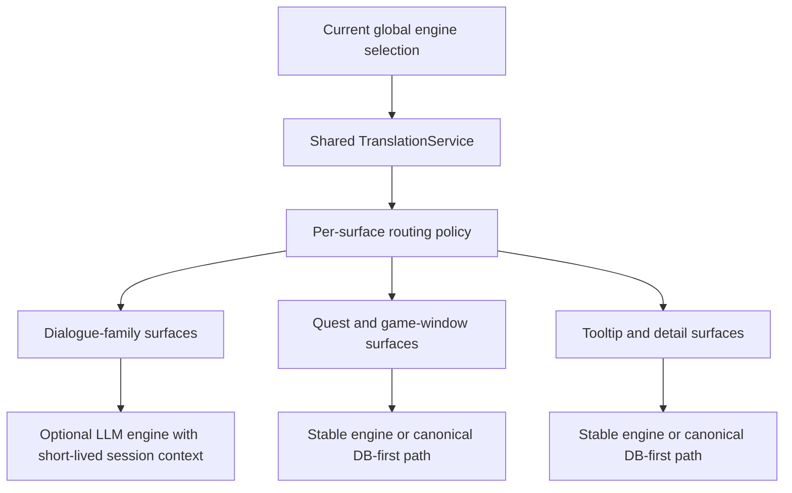
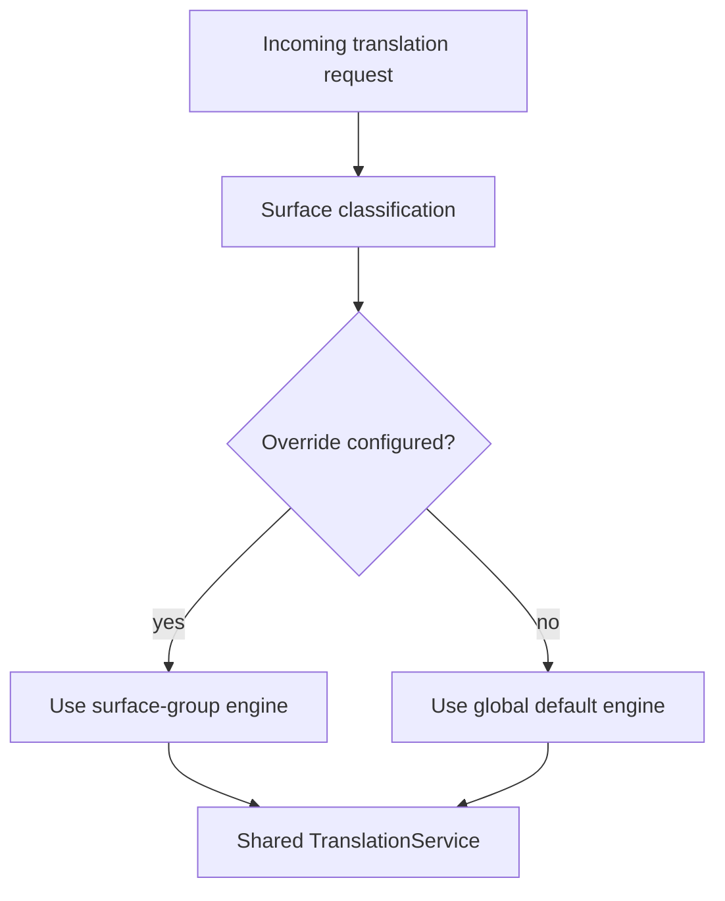

# LLM Translation Improvements Plan

## Purpose

This document captures the current direction for improving Echoglossian's
LLM-backed translation path.

The immediate motivation is twofold:

- reduce avoidable latency and token cost in the current single-shot LLM flow
- allow better control over which UI surfaces should use expensive LLM engines
  versus cheaper or simpler engines

This rework explicitly includes the operator-facing retranslation and DB
semantics currently represented by `#174`, because issue comments show that
engine experimentation, cached-row reuse, and "why did this not retranslate"
are part of the same user pain as the LLM engine flow itself.

Issue comments and recent regressions show that the real problem is broader
than "prompt optimization":

- users need visible feedback when an LLM quota, endpoint, or upstream service
  fails instead of a silent fallback to original text
- local LLM users are paying repeated request overhead and repeated prompt cost
  even when the model itself is fast
- users experimenting with multiple engines want clearer retranslation and DB
  semantics, not only runtime switching
- users want custom OpenAI-compatible providers without pretending every one of
  them is the built-in ChatGPT/OpenAI path
- recent bugs around engine/model switching showed that LLM work must respect
  the plugin's shared runtime-refresh and handler-lifecycle architecture

This is a design-direction document, not a promise that every item here should
land in one branch or one release.

## Problem Summary

Today, Echoglossian mostly treats LLM-backed engines as stateless
single-request translators:

- one text in
- one prompt built
- one request sent
- one translated text returned

That keeps persistence and caching deterministic, but it has clear downsides:

- the same large instruction block is rebuilt and resent for many short lines
- local LLM setups such as LM Studio and Ollama pay repeated per-request
  overhead
- the plugin cannot distinguish between "use LLM for dialogue" and "use a
  cheaper engine for generic UI"
- there is no controlled concept of short-lived dialogue context

Recent issue comments reinforce a few specific pain points:

- `#201`: when usage limits or endpoints fail, the current UX is too quiet and
  users often only see untranslated text without actionable feedback
- `#176`: local LLM users care about end-to-end latency, prompt size, and
  avoiding unnecessary repeated context per line
- `#174`: once users experiment with different engines, the current
  retranslation and DB-reuse behavior becomes hard to reason about
- `#196`: users want custom OpenAI-compatible providers, not just the current
  first-party/fixed-provider menu
- `#190`, `#191`, and `#198` showed that engine work cannot ignore runtime
  rebuild semantics, handler lifecycle, and shared cache correctness

## Design Goals

1. Reduce avoidable token and request overhead for LLM engines.
2. Keep the current shared `TranslationService` architecture.
3. Avoid breaking DB semantics or canonical cache behavior.
4. Allow finer control over engine usage by UI surface category.
5. Introduce dialogue context only where it improves quality enough to justify
   the extra complexity.

## Non-Goals

- no global always-on chat session shared by the whole plugin
- no engine-specific persistence pipeline
- no context-dependent DB pollution by default
- no broad rewrite of non-LLM translators just to match the LLM flow

## Current Architectural Constraint

The current persistence model assumes that a translated output is primarily a
function of:

- source text
- source language
- target language
- chosen engine

Long-lived multi-turn history weakens that assumption.

If the same line is translated differently because a different history was
attached, then:

- cache reuse becomes less predictable
- DB rows become less stable
- reproducing bugs becomes harder

That means session/history support should start as an in-memory runtime
improvement, not as a new persistence contract.

## Recommendation Overview

The key idea is:

- **dialogue-family surfaces** may benefit from a short-lived LLM session
- **quest, tooltip, and canonical UI surfaces** usually benefit more from
  determinism, cache reuse, and lower token cost

## Improvement Areas

## 0. Reliability and Operator Feedback

Before adding more intelligence, the LLM path should become easier to trust and
operate.

### User-facing pain

- today, quota exhaustion, endpoint errors, or upstream timeouts often degrade
  into "original text came back" without enough explanation
- users experimenting with providers and models want to know whether the plugin
  failed because of:
  - invalid credentials
  - rate or quota limit
  - transport failure
  - unsupported provider behavior
  - cached DB reuse rather than a new live request

### Desired outcome

- concise notifications for quota-limit / endpoint-failure classes
- a normalized error taxonomy across LLM-style engines
- clearer distinction between:
  - original fallback
  - cached DB reuse
  - live translation failure

### Related issues

- `#201`
- `#174`

## 1. Shared LLM Request Infrastructure

This is the safest first step.

### Current pain

- prompt construction is duplicated across multiple translators
- some engines still embed a long monolithic prompt inline
- request shape is similar across OpenAI-style engines but implemented
  separately

### Desired outcome

- a shared prompt builder for LLM engines
- shared helper(s) for OpenAI-style chat-completions request assembly
- consistent trimming, quote removal, and synthetic-error handling

### Why this matters

It reduces drift, makes prompt compaction easier, and creates one place to
apply future improvements across:

- ChatGPT / OpenAI
- OpenRouter
- DeepSeek
- LM Studio
- possibly other OpenAI-compatible providers later

## 2. Compact Prompt Strategy

### Current pain

- local engines are paying for a verbose instruction block on every line
- issue `#176` suggests there is material overhead outside pure model runtime

### Desired outcome

- keep a high-quality default prompt
- add a shorter prompt variant specifically for local LLM workloads
- prefer `system` + `user` separation where the target API supports it

### Guardrail

Prompt shortening should be measured against translation quality and not be
treated as a free win.

## 3. Per-Surface Engine Routing

This is the feature most directly related to token control.

### User-facing need

A user may want:

- an LLM for `Talk`, `BattleTalk`, or other dialogue-family content
- a cheaper or simpler engine for UI surfaces such as mission windows,
  tooltips, or menus

That is a valid and useful direction.

### Why it helps

- reduces token spend
- reduces local-LLM queue pressure
- allows stable non-dialogue surfaces to stay on more deterministic engines
- lets users reserve LLM quality for the places where tone and context matter
  most

### Recommended scope model

Do not start with per-addon-per-engine for every single handler.

Start with **surface groups**:

- `Dialogue LLM surfaces`
  - `Talk`
  - `BattleTalk`
  - `TalkSubtitle`
  - `MiniTalk`
- `Quest and mission UI`
  - `Journal`
  - `JournalDetail`
  - `ScenarioTree`
  - `ToDoList`
  - `RecommendList`
  - `JournalAccept`
  - `JournalResult`
- `Reference and game-window UI`
  - `MainCommand`
  - `ActionMenu`
  - `AddonContextMenuTitle`
  - other DB-first game windows
- `Tooltip and detail UI`
  - structured tooltip/detail families once re-enabled

This gives meaningful token control without exploding the config model.

### Suggested routing model

### Guardrails

- keep one shared `TranslationService`
- do not fork persistence by engine family
- do not create per-addon bespoke translator pipelines
- route by policy before translator invocation

## 4. Short-Lived Dialogue Session Context

This is the most attractive feature for quality, but also the riskiest.

### Where it makes sense

- `Talk`
- maybe `BattleTalk`
- maybe `MiniTalk`

### Where it does **not** make sense

- `Journal`
- `JournalDetail`
- `ScenarioTree`
- `ToDoList`
- `MainCommand`
- `ActionMenu`
- tooltip/detail surfaces

### Recommended constraints

- in-memory only
- no cross-surface session sharing
- short TTL
- small rolling window, for example the last 2 to 4 translated turns
- keyed by conversation-like runtime identity

### Example session key inputs

- addon family
- speaker name when available
- active conversation or visible addon instance identity
- optional target language / engine

### Why not a global chat session

A single global session would:

- bleed context across unrelated NPCs and windows
- make translations less deterministic
- increase debugging difficulty
- create more pressure to persist or replay history

### First safe policy

- use session context only for runtime quality
- do not let that history redefine canonical DB semantics at first

## 5. Persistence and Cache Semantics

This is the main safety boundary.

### Recommendation

For the first version of dialogue session context:

- keep persistence behavior conservative
- prefer runtime-only benefit over aggressive DB reuse
- do not assume history-aware output is equivalent to a canonical no-history
  translation

### Practical options

1. **No persistence for session-aware output initially**
   - safest
   - lowest semantic risk
   - loses some reuse

2. **Persist only when output matches the base no-history result**
   - safer than unconditional persistence
   - more complex

3. **Persist session-aware output with explicit metadata**
   - richest
   - highest complexity
   - not a first-pass target

The recommended first option is **runtime-only session improvement**.

## 6. Retranslation and Experimentation Semantics

Issue comments show that many advanced users actively compare providers, swap
models, and expect previously stored text to become manageable when they do so.

### User-facing pain

- changing engine/model often implies "I want to compare again", but stored rows
  may continue to win
- users sometimes resort to clearing DB state externally
- current behavior is hard to predict when a row is cached, when a live request
  will be attempted, and when a retranslation request should rewrite or merely
  override the display

### Desired outcome

- make the operator workflow explicit:
  - reuse existing translation
  - retranslate visible text only
  - retranslate and rewrite persisted row
  - clear or prune relevant cached scope
- keep the DB as source of truth, but expose enough control that translator
  experiments do not feel "sticky" or opaque

### Related issues

- `#174`
- adjacent to `#201` because visible error/fallback feedback and explicit
  retranslation controls belong to the same operator experience

## Implementation Phases

## Phase 1: Reliability, Error Taxonomy, and Shared LLM Infrastructure

Target:

- normalized LLM error categories
- visible failure feedback for quota/endpoint problems
- prompt builder shared by LLM translators
- OpenAI-style request helper(s)
- consistent response normalization

Expected benefit:

- immediate improvement for `#201`
- lower maintenance cost
- easier future compaction and instrumentation

## Phase 2: Prompt Compaction and Telemetry

Target:

- compact prompt profile for local LLMs
- optional instrumentation for:
  - request latency
  - prompt size
  - completion size

Expected benefit:

- measurable path to improve `#176`
- better foundation for comparing local LLMs against remote providers

## Phase 3: Surface-Group Engine Routing

Target:

- optional LLM-engine override per surface group
- global engine remains default

First-rollout constraint:

- surface-group overrides should only exist for LLM-backed engines at first
- non-LLM engines should continue using the global engine path until this
  design proves itself and the UX stays understandable

Expected benefit:

- token-control feature users actually asked for
- better split between dialogue quality and UI-cost control
- natural place to support custom OpenAI-compatible providers without making the
  global engine dropdown do everything at once

## Phase 4: Custom OpenAI-Compatible Provider Support

Target:

- one generic OpenAI-compatible provider path
- configurable base URL, API key, and model
- shared request path with the existing OpenAI-style infrastructure

Expected benefit:

- direct path to `#196`
- avoids cloning bespoke per-provider translator implementations

## Phase 5: Experimental Dialogue Session Context

Target:

- runtime-only short-lived context for `Talk`
- guarded rollout, ideally behind explicit config

Expected benefit:

- better tone and consistency across consecutive lines

## Phase 6: Retranslation and DB Operator Controls

Target:

- explicit user-facing retranslation workflow
- narrow DB-management actions for translator experimentation
- clearer distinction between display override and persistent rewrite

Expected benefit:

- addresses the operator pain in `#174`
- reduces the temptation to solve engine experimentation by manual DB surgery

## Phase 7: Expansion to Other Dialogue Families

Only after `Talk` proves stable:

- evaluate `BattleTalk`
- evaluate `MiniTalk`

Do not expand by default to non-dialogue surfaces.

## Suggested Configuration Direction

This is a direction, not a final schema:

- `GlobalTranslationEngine`
- `UseDialogueLlmOverride`
- `DialogueLlmEngine`
- `UseQuestUiLlmOverride`
- `QuestUiLlmEngine`
- `UseReferenceUiLlmOverride`
- `ReferenceUiLlmEngine`
- `UseTooltipLlmOverride`
- `TooltipLlmEngine`
- `ShowLlmFailureNotifications`
- `CustomOpenAiCompatibleBaseUrl`
- `CustomOpenAiCompatibleApiKey`
- `CustomOpenAiCompatibleModel`
- `EnableDialogueSessionContext`
- `DialogueSessionHistoryLimit`
- `DialogueSessionTtlSeconds`

That is already a lot. It should be introduced carefully and grouped in the UI
so it does not become a configuration disaster.

## Working Decisions

These are current working decisions for the first implementation pass unless
they are explicitly revisited later.

1. Surface-group engine routing should start as an **LLM-only override**
   feature.
   - The global engine remains the base path for everything.
   - Only LLM-backed engine selections get per-group override controls in the
     first rollout.
   - Whether this later expands to all engines remains a future product
     decision, not a first-pass requirement.
2. The scope of this rework **includes `#174`**.
   - Retranslation behavior, DB reuse semantics, and translator-experiment
     workflows are part of the same operator experience as the LLM engine
     improvements.
   - This means the rework is not only about prompts and providers; it must
     also leave users with a clearer path for forcing or understanding
     retranslation behavior.
3. Local-LLM compact prompts should be **per-engine**.
   - Prompt compaction should be tailored per provider from the beginning
     instead of starting from a shared local-engine baseline.
   - This accepts a little more implementation complexity in exchange for
     tighter control over latency, token use, and engine-specific behavior.
4. Custom OpenAI-compatible support should be an **OpenAI-family variant**.
   - It should reuse the existing OpenAI-style request model and architecture
     instead of becoming a fully separate engine family in the first pass.
   - The operator-facing configuration can still make that variant clear and
     explicit.
5. Session-aware translations should be **runtime-only and never persisted**
   in the first pass.
   - Session context is allowed to improve live dialogue output.
   - It should not alter DB semantics or make stored translations depend on
     transient conversational state.
6. Metrics should be exposed through a **dedicated Translator Debugger and
   Metrics command and window**.
   - Metrics should be aggregated and inspected on demand.
   - Hot-path logging should remain quiet by default.
7. The first operator-facing retranslation control should be **explicit
   `retranslate visible text and persist`**.
   - This is the safest first control because it is concrete, limited in
     scope, and easy to reason about.
   - Broader DB-clear or rewrite operations can come later as advanced tools.
8. `BattleTalk` should **reuse the same session infrastructure as `Talk`, but
   remain isolated in its own session namespace**.
   - Shared implementation is good.
   - Shared conversation state is not.

## Questions Answered For The First Pass

These questions are now treated as answered for the current implementation
pass. They can be revisited later, but they should not block design or cause
the first rollout to drift.

1. Local-LLM compact prompts: **per-engine**
2. Custom OpenAI-compatible support: **OpenAI-family variant**
3. Session-aware persistence: **runtime-only, no persistence**
4. Metrics exposure: **dedicated Translator Debugger and Metrics command and
   window**
5. First retranslation control: **explicit `retranslate visible text and
   persist`**
6. `BattleTalk` session model: **reuse infrastructure, but isolate
   `BattleTalk` sessions**

## Decision Prompts

Use this section when turning the current direction into concrete product
choices. Each item is phrased so it can be answered directly.

### D1. Compact prompt strategy

Choose one:

- shared compact prompt baseline for local LLM engines, with narrow per-engine
  overrides only when necessary
- fully per-engine compact prompts from the beginning

Recommended first answer:

- shared baseline first

Chosen answer:

- fully per-engine compact prompts from the beginning

### D2. Custom OpenAI-compatible provider model

Choose one:

- configurable variant of the existing OpenAI family
- first-class engine entry with its own dedicated UI and routing

Recommended first answer:

- configurable OpenAI-family variant

Chosen answer:

- configurable variant of the existing OpenAI family

### D3. Session-aware persistence

Choose one:

- runtime-only session context, no persistence
- persist only when the session-aware output matches the no-history output
- persist session-aware output with explicit metadata

Recommended first answer:

- runtime-only, no persistence

Chosen answer:

- runtime-only session context, no persistence

### D4. Metrics exposure

Choose one:

- debug or DB-manager panel with aggregated metrics only
- config UI surface with lightweight status plus debug panel for details
- log-driven metrics

Recommended first answer:

- aggregated metrics in a debug or DB-manager surface, not hot-path logs

Chosen answer:

- dedicated Translator Debugger and Metrics command and window

### D5. First retranslation control

Choose one:

- explicit `retranslate visible text and persist`
- targeted DB clear/prune action first
- broad per-surface rewrite first

Recommended first answer:

- `retranslate visible text and persist`

Chosen answer:

- explicit `retranslate visible text and persist`

### D6. BattleTalk session model

Choose one:

- reuse the `Talk` session model with shared conversation state
- reuse the `Talk` session infrastructure but isolate `BattleTalk` sessions
- no `BattleTalk` session support in the first rollout

Recommended first answer:

- reuse the same infrastructure, but isolate `BattleTalk` sessions

Chosen answer:

- reuse the `Talk` session infrastructure but isolate `BattleTalk` sessions

## Recommended Next Step

The next implementation step should be:

1. build normalized LLM error handling and visible feedback
2. build shared LLM prompt/request infrastructure
3. introduce prompt-compaction support for local LLM engines
4. add surface-group engine routing
5. only then evaluate custom-provider rollout and dialogue session context

Dialogue session context should come after those pieces exist, not before.

That order gives the best chance of improving latency and token control without
making persistence and debugging dramatically worse, while also addressing the
practical operator pain visible in `#201`, `#176`, `#196`, and `#174`.
