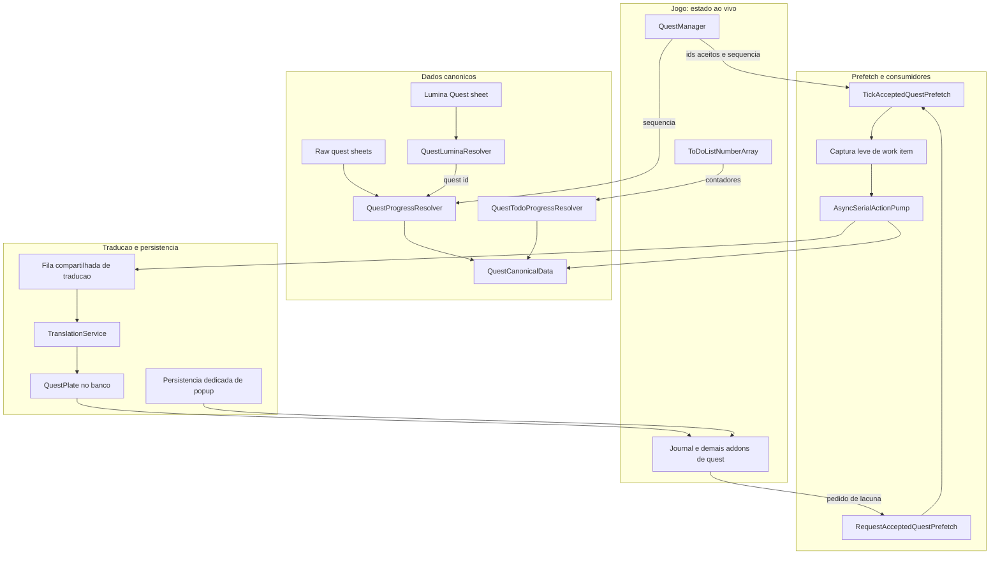
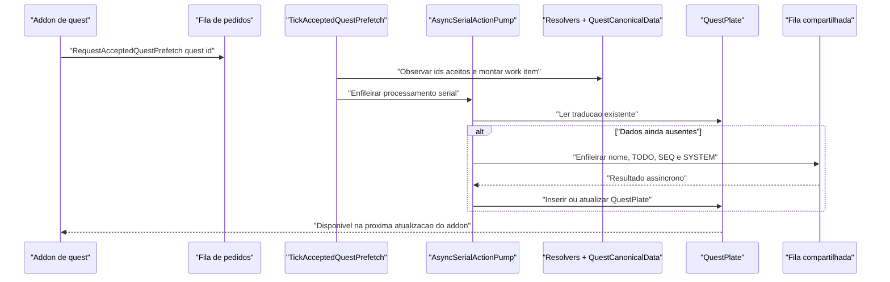

# Sistema de Quests: Estado Atual da Branch

> Snapshot em 2026-08-03 da worktree `feature/issues-230-233-234`, com base no HEAD `8008fa6` e nas alteracoes locais desta worktree que ainda nao foram publicadas.

## Escopo

Este documento cobre exclusivamente o sistema de quests e seus consumidores:

- `QuestManager`
- Lumina e raw quest sheets
- progresso e prefetch de quests aceitas
- `QuestPlate`
- `Journal`
- `JournalDetail`
- `JournalAccept`
- `JournalResult`
- `_ToDoList`
- `ScenarioTree`
- `RecommendList`
- `AreaMap`

`Action`, `Item`, `Trait`, `ActionDetail`, `ItemDetail`, `MainCommand`,
`ContextMenu`, `Tooltip` e `NamePlate` nao fazem parte deste documento.

## Mudancas relevantes desde o snapshot de 2026-07-24

O estado atual da branch mudou em quatro pontos que afetam diretamente o fluxo
de quest:

1. **Politica overlay-only aplicada na familia Journal**
   - idiomas marcados como overlay-only, como arabe, nao devem mais escrever
     traducao nos nodes nativos de quest
   - os modos efetivos colapsam para apresentacao overlay/tooltip quando a
     politica da lingua exige isso

2. **Reset seguro ao trocar idioma-alvo ou assinatura de traducao**
   - addons visiveis sao restaurados para o texto original antes da limpeza de
     caches e rebuild de runtime
   - isso evita misturar residuos da lingua anterior com a lingua seguinte

3. **Fallback persistido para `_ToDoList`**
   - quando o progresso ao vivo ainda nao esta resolvido, `_ToDoList` pode
     reutilizar o titulo traduzido ja persistido em `QuestPlate`
   - objetivos continuam dependendo de mapeamento de progresso confiavel; nao
     sao adivinhados sem identidade estavel

4. **Accepted quest prefetch saiu do caminho quente**
   - o `Framework.Update` continua sendo o gatilho de observacao
   - o trabalho caro de DB e traducao foi movido para processamento serial em
     background depois de uma captura leve
   - o espelhamento no `Echoglossian.log` ficou mais seletivo

## Regras de autoria dos dados

| Dado | Dono | Uso no plugin |
| --- | --- | --- |
| Quests aceitas e sequencia atual | `QuestManager` do jogo | Define quais quests pertencem ao jogador e qual etapa esta ativa |
| Contadores dos objetivos visiveis | `ToDoListNumberArray` do jogo | Complementa a sequencia com progresso numerico do objetivo; nao define o texto-fonte |
| Nome, textos e chaves de quest | Sheets Lumina `Quest` e raw quest sheets | Fonte canonica do texto original e das chaves `_TODO_`, `_SEQ_` e `_SYSTEM_` |
| Traducao persistida | Banco `QuestPlate` | Guarda o resultado de traducao e as projecoes compativeis com consumidores legados |
| Texto atualmente desenhado | Addons e nodes Atk | Apenas apresentacao e pista de qual quest esta visivel; nunca e a fonte de verdade da identidade ou do progresso |
| Popup sem quest id confiavel | Persistencia dedicada do popup | Isola payloads vivos de `JournalAccept` quando ainda nao existe um quest id seguro para gravar em `QuestPlate` |

Em resumo: o jogo diz **qual quest e qual etapa**; Lumina diz **qual e o texto
original daquela etapa**; `QuestPlate` guarda **a traducao canonica da quest**;
popups usam persistencia dedicada apenas quando a identidade canonica ainda nao
esta disponivel; os addons apenas exibem o resultado.

## Visao geral

## Identidade e Progresso

### `QuestManager`

`QuestManager` continua sendo o dono da verdade sobre o estado do personagem:

- `NormalQuests` e `DailyQuests` fornecem os IDs das quests aceitas
- `GetQuestSequence` fornece a sequencia atual
- o prefetch coleta, deduplica e ordena esses IDs antes de trabalhar

Ele nao fornece os textos completos da quest. O fluxo correto continua sendo:
resolver identidade por ID e sequencia, depois buscar o texto original em
Lumina/raw sheets.

### `QuestLuminaResolver`

Este helper faz a ponte entre um nome visivel e um ID de quest:

1. normaliza o nome visivel
2. consulta a sheet `Quest` no idioma do cliente
3. resolve o ID da linha correspondente

Esse passo continua sendo **ponte de identificacao**, nao fonte de verdade.
Uma vez obtido o ID, os consumidores posteriores devem trabalhar por ID,
sequencia e chave canonica.

### `QuestProgressResolver`

Recebe o ID e consulta a sequencia atual no `QuestManager`. Depois abre o raw
sheet da quest e extrai os textos da sequencia ativa:

- `_TODO_`: objetivos
- `_SEQ_`: mensagens de etapa
- `_SYSTEM_`: mensagens auxiliares

O resultado e um `QuestProgressSnapshot`, indexado por `QuestId:QuestSequence`,
com hash do conteudo-fonte para diferenciar mudanca real de dados entre versoes
do jogo.

### `QuestTodoProgressResolver`

Especializa o snapshot para `_ToDoList`:

- parte do `QuestProgressSnapshot`
- cruza o estado com `ToDoListNumberArray`
- monta um cache que inclui ID, sequencia e contadores

`_ToDoList` continua sendo projecao de uma quest aceita, nao uma segunda fonte
de quests aceitas.

### `QuestCanonicalData`

Transforma o snapshot de progresso numa estrutura de lookup que preserva
contexto:

- `QuestId`
- sequencia ativa
- chaves das linhas da sheet
- mapas separados para `TODO`, `SEQ` e `SYSTEM`
- hash do conteudo original
- sinalizacao de projecao textual com perda quando textos repetidos aparecem em
  chaves diferentes

Esse continua sendo o principal mecanismo para impedir associacao errada entre
objetivos e etapas diferentes.

## Prefetch de quests aceitas

O prefetch continua sendo unico e compartilhado. Um addon nao deve abrir sua
propria fila e nao deve chamar o tradutor no callback da UI.

### Estado atual do runtime

`AcceptedQuestPrefetchRuntime` agora tem duas fases distintas:

1. **Captura leve no tick**
   - roda pelo `Framework.Update`, chamado por `PluginRuntimeUi.Tick`
   - observa quests aceitas, sequencia, pedidos prioritarios e sinais de
     mudanca
   - captura o minimo necessario para montar um work item estavel

2. **Processamento serial em background**
   - work items entram em um `AsyncSerialActionPump`
   - o worker executa lookup em `QuestPlate`, resolve lacunas e enfileira
     traducao quando necessario
   - persistencia e reaproveitamento continuam centralizados

### Sequencia atual

### Regras operacionais atuais

- intervalo interno continua em dois segundos
- no maximo duas quests por ciclo
- pedidos explicitamente despertados por uma superficie tem prioridade
- o runtime so opera se:
  - traducao estiver habilitada
  - o jogador estiver pronto
  - existir ao menos uma superficie de quest relevante habilitada

### Logging atual

- `accepted-quest-prefetch-activity.log` continua sendo a trilha verbosa
- o `Echoglossian.log` espelha apenas fases de maior sinal, como pedidos,
  cache-hit, traducao resolvida e falhas
- o dump canonico pesado esta desligado por default no codigo atual

## `QuestPlate` e compatibilidade

`QuestPlate` continua sendo a persistencia canonica das traducoes de quest.

A identidade desejada de uma traducao continua composta por:

- quest
- idiomas
- engine
- versao do jogo
- hash do original

O formato ainda carrega projecoes de texto e caminhos de compatibilidade
legados. Fallback por nome ainda existe para compatibilidade, mas nao deve
decidir progresso nem escolher entre quests de mesmo titulo quando existe um ID
canonico disponivel.

## Consumidores

| Superficie | Papel | Dados que deve consumir | Comportamento atual quando falta traducao |
| --- | --- | --- | --- |
| `Journal` | Lista de quests | ID resolvido pelo nome visivel, `QuestProgressSnapshot`, `QuestCanonicalData`, `QuestPlate` | Pede prefetch da quest aceita; nao adivinha outra quest por titulo solto |
| `JournalDetail` | Painel completo da quest selecionada | Mesmo modelo canonico de `QuestPlate`, com titulo, descricao, objetivos e mensagens contextualizados | Pede prefetch do ID resolvido e atualiza em ciclo posterior |
| `_ToDoList` | Objetivo ativo na HUD | Quest aceita, sequencia, chaves `TODO` e contadores do `ToDoListNumberArray` | Reusa titulo traduzido persistido quando o progresso ao vivo ainda nao resolveu; so requeuea quando nao existe dado persistido util |
| `ScenarioTree` | Etapas e objetivos de cenario | Snapshot de progresso e dados canonicos da quest | Consome a mesma traducao persistida e respeita overlay-only no modo efetivo |
| `JournalAccept` | Oferta de quest | Captura viva do popup, `QuestPlate` compartilhado quando o ID e confiavel, e persistencia dedicada de popup quando nao e | Captura titulo/corpo ao vivo, enfileira traducao assincrona e aplica pelo modo configurado sem contaminar `QuestPlate` quando a identidade ainda e incerta |
| `JournalResult` | Resultado/conclusao de quest | `QuestPlate` canonico, lookup por titulo e fallback de popup | Prioriza `QuestPlate` por ID, depois tenta match por titulo, e por fim cai para traducao viva quando ainda nao existir linha |
| `RecommendList` | Lista de recomendacoes | Lookup canonico e prefetch compartilhado | Pode disparar ou consumir prefetch, mas nao e fonte de verdade |
| `AreaMap` | Texto de quest em UI de mapa | Lookup canonico e prefetch compartilhado | Pode disparar ou consumir prefetch, mas nao redefine identidade da quest |

## `JournalAccept` e `JournalResult`

Esses popups seguem regras adicionais porque o addon visivel nem sempre entrega
um quest ID seguro no momento da captura.

### `JournalAccept`

Estado atual esperado:

- captura em tempo real de titulo e corpo
- fila assincrona e cache local
- persistencia dedicada quando ainda nao ha quest ID confiavel
- aplicacao por modo continua separada:
  - native UI
  - apresentacao por tooltip/overlay do plugin
  - swap

Quando o popup carrega strings formatadas, a montagem da apresentacao do plugin
deve preservar payloads legiveis de `SeString` sempre que o runtime conseguir
captura-los com seguranca.

### `JournalResult`

Estado atual esperado:

1. tentar `QuestPlate` por quest ID
2. se nao houver ID, tentar match por titulo
3. se ainda nao houver linha, cair para traducao em tempo real

O popup segue o mesmo contrato de modos e restauracao da familia Journal. O
modo efetivo tambem respeita a politica overlay-only da lingua alvo.

## Modos de apresentacao

Os modos continuam alterando apenas a apresentacao depois que a traducao correta
foi resolvida:

- **Overlay / tooltip do plugin**: mantem o node nativo intacto e mostra a
  traducao externamente
- **UI nativa**: escreve a traducao no node nativo
- **Swap**: mostra traducao na UI nativa e o original na apresentacao do plugin

### Regra adicional atual: overlay-only

Para linguas marcadas como overlay-only:

- quest-family handlers nao devem escrever traducao nativa
- modos que implicariam escrita nativa colapsam para apresentacao do plugin
- isso vale para `Journal`, `JournalDetail`, `JournalAccept`,
  `JournalResult`, `_ToDoList`, `ScenarioTree`, `RecommendList` e afins

## Refresh de runtime e troca de idioma

Quando a assinatura de traducao muda (por exemplo, troca de idioma alvo):

1. addons visiveis que tiveram mutacao nativa nossa sao restaurados
2. overlays, hover state e caches de sessao sao limpos
3. translator e broker sao reconstruidos
4. handlers sao re-registrados/refrescados

O objetivo e impedir que o texto traduzido da lingua anterior sobreviva no node
nativo enquanto a nova lingua comeca a aplicar.

## Ciclo de vida dos handlers de quest

Todos os handlers de quest continuam recebendo o mesmo
`QuestAddonHandlerDependencies` por `QuestAddonWiring` e herdam operacoes
comuns de `QuestAddonHandlerBase`:

- acesso a configuracao e `TranslationService` compartilhados
- leitura, insercao e atualizacao de `QuestPlate`
- normalizacao de texto
- enfileiramento compartilhado
- pedido de prefetch de quest aceita
- registro e remocao de apresentacao auxiliar do plugin
- guardas globais de desativacao e lifecycle seguro

Os handlers continuam se inscrevendo em eventos como:

- `PreUpdate`
- `PreRequestedUpdate`
- `PreDraw`
- `PreHide`
- `PreFinalize`

A regra continua a mesma: capturar e decidir no lifecycle, sem bloquear o jogo
esperando traducao.

## Riscos e limites conhecidos

- titulo visivel nao e globalmente unico; qualquer fallback por nome precisa
  rejeitar ambiguidade quando existir mais de uma linha plausivel
- nodes Atk podem ser reciclados entre entradas; estado por ponteiro precisa
  validar texto ou identidade atual antes de reaplicar traducao
- textos repetidos em chaves diferentes dos raw sheets continuam tornando
  mapas so por texto potencialmente com perda
- chegada da traducao continua assincrona; a primeira abertura pode permanecer
  original e uma atualizacao posterior deve consumir a linha persistida
- `_ToDoList` nao deve inventar objetivo traduzido sem mapeamento de progresso
  confiavel; o fallback persistido desta rodada e deliberadamente limitado ao
  titulo da quest

## Observabilidade e testes

- use `/egloaddonprobe Journal`, `/egloaddonprobe JournalDetail`,
  `/egloaddonprobe JournalAccept`, `/egloaddonprobe JournalResult`,
  `/egloaddonprobe _ToDoList` e `/egloaddonprobe ScenarioTree` para capturar a
  estrutura real dos addons
- `accepted-quest-prefetch-activity.log` continua sendo a trilha mais detalhada
  do prefetch
- `Echoglossian.Tests/QuestAddonHandlerLifecycleTests.cs` cobre lifecycle e
  wiring dos handlers de quest
- testes de contrato e policy cobrem:
  - colapso overlay-only
  - restauracao antes de rebuild
  - fallback persistido de `_ToDoList`
- `DalaMock` e `Echoglossian.Mock` continuam sendo o caminho preferido antes do
  teste in-game quando o fluxo depender de estado do jogo e lifecycle

## Mudancas recentes de branch que alteraram o fluxo

| Mudanca | Estado |
| --- | --- |
| `fix(quest): honor overlay-only language policy` | Ja commitada na branch |
| `fix(runtime): restore visible addons before reset` | Ja commitada na branch |
| `fix(todo): reuse persisted quest titles while progress loads` | Ja commitada na branch |
| `AcceptedQuestPrefetchRuntime` com work items serializados em background e log mais silencioso | Presente nesta worktree, ainda nao publicada no remoto |

## Arquivos de referencia

- [QuestAddonWiring.cs](C:/Dante/_dalamud/Echoglossian/.worktrees/issues-230-233-234/NativeUI/Helpers/QuestAddonWiring.cs)
- [QuestAddonHandlerBase.cs](C:/Dante/_dalamud/Echoglossian/.worktrees/issues-230-233-234/NativeUI/AddonHandlers/Quest/QuestAddonHandlerBase.cs)
- [AcceptedQuestPrefetchRuntime.cs](C:/Dante/_dalamud/Echoglossian/.worktrees/issues-230-233-234/NativeUI/Helpers/AcceptedQuestPrefetchRuntime.cs)
- [QuestLuminaResolver.cs](C:/Dante/_dalamud/Echoglossian/.worktrees/issues-230-233-234/NativeUI/Helpers/QuestLuminaResolver.cs)
- [QuestProgressResolver.cs](C:/Dante/_dalamud/Echoglossian/.worktrees/issues-230-233-234/NativeUI/Helpers/QuestProgressResolver.cs)
- [QuestTodoProgressResolver.cs](C:/Dante/_dalamud/Echoglossian/.worktrees/issues-230-233-234/NativeUI/Helpers/QuestTodoProgressResolver.cs)
- [QuestCanonicalData.cs](C:/Dante/_dalamud/Echoglossian/.worktrees/issues-230-233-234/NativeUI/Helpers/QuestCanonicalData.cs)
- [JournalHandler.cs](C:/Dante/_dalamud/Echoglossian/.worktrees/issues-230-233-234/NativeUI/AddonHandlers/Quest/JournalHandler.cs)
- [JournalDetailHandler.cs](C:/Dante/_dalamud/Echoglossian/.worktrees/issues-230-233-234/NativeUI/AddonHandlers/Quest/JournalDetailHandler.cs)
- [JournalAcceptHandler.cs](C:/Dante/_dalamud/Echoglossian/.worktrees/issues-230-233-234/NativeUI/AddonHandlers/Quest/JournalAcceptHandler.cs)
- [JournalResultHandler.cs](C:/Dante/_dalamud/Echoglossian/.worktrees/issues-230-233-234/NativeUI/AddonHandlers/Quest/JournalResultHandler.cs)
- [ToDoListHandler.cs](C:/Dante/_dalamud/Echoglossian/.worktrees/issues-230-233-234/NativeUI/AddonHandlers/Quest/ToDoListHandler.cs)
- [Quest addon translation runtime flow](C:/Dante/_dalamud/Echoglossian/.worktrees/issues-230-233-234/docs/quest-addon-translation-runtime-flow.md)
- [Journal quest data model and flow](C:/Dante/_dalamud/Echoglossian/.worktrees/issues-230-233-234/docs/journal-quest-data-model-and-flow.md)
