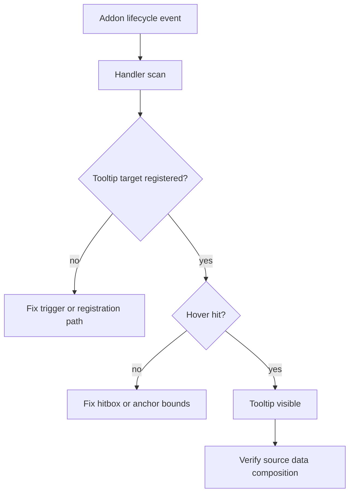

# Quest Tooltip Validation Notes

## Purpose

This document captures the current in-game validation state for quest-family
tooltips and hover triggers in Echoglossian.

It is intentionally focused on observed runtime behavior rather than desired
design. The goal is to keep a short, reusable memory of what was seen while
testing the current quest runtime stack.

## Validation Snapshot

The current live config snapshot has the quest family enabled for translation
and hover support:

- `TranslateJournal = true`
- `TranslateJournalAccept = true`
- `TranslateJournalResult = true`
- `TranslateRecommendList = true`
- `TranslateAreaMap = true`
- `TranslateScenarioTree = true`
- `TranslateToDoList = true`
- `TranslateTooltips = true`
- `JournalTranslationDisplayMode = 1`

The in-game test results were:

- `Journal` and `JournalDetail` produced tooltip registrations.
- `JournalDetail` hitbox coverage improved, but the body trigger still feels
  smaller than ideal.
- `JournalDetail` body tooltips show original text first and then translate as
  the DB catches up, which is acceptable.
- The body content still does not always match the full `QuestPlate` content;
  in practice it mostly shows the description and multiple objectives, while
  the summary only appears occasionally.
- `ToDoList`, `ScenarioTree`, `RecommendList`, and `AreaMap` did not emit
  tooltip registrations in the observed test window.
- `AreaMap` lifecycle events did fire when the addon opened, but no tooltip
  registration followed.

## What This Suggests

The current runtime behavior points to two separate problems:

1. `Journal` and `JournalDetail` are mostly working, but `JournalDetail` still
   needs a better body trigger and a more complete source composition strategy.
2. Some quest addons can still short-circuit on cache hits before re-registering
   hover targets, which makes them look silent after the first translated pass.
   This showed up most clearly in `ToDoList` and `AreaMap`.
3. The other quest addons likely still have a trigger or registration gap, not
   just a translation gap.

The data-source direction remains the same:

- UI is good for identifying the active quest surface.
- Lumina and quest sheet acquisition should drive the actual quest content.
- Runtime progress should come from director data.
- Tooltip registration should only consume the final composed text.

## Suggested Debug Flow

When these issues recur, the safest order is:

1. confirm the addon lifecycle event is firing
2. confirm a tooltip target is registered
3. confirm the hover rect is large enough to hit
4. confirm the tooltip body is reading the right source data

## Related Docs

- [Quest Addon Translation Runtime Flow](./quest-addon-translation-runtime-flow.md)
- [Journal Quest Data Model and Flow](./journal-quest-data-model-and-flow.md)
- [Quest Sheet Acquisition Pipeline](./quest-sheet-acquisition-pipeline.md)
- [Structured Text Payload Pipeline](./structured-text-payload-pipeline.md)
