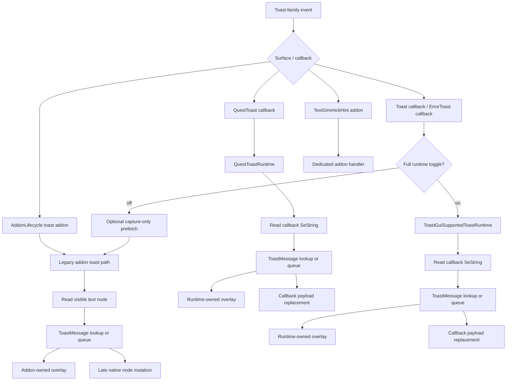

# Toast Runtime Current State

This document captures the actual toast runtime state on
`issue-188-minitalk-toast-reflow-followup`.

It covers:

- which runtime owns capture
- which runtime owns translation lookup and persistence
- which runtime owns overlay publication
- which runtime owns native mutation
- where `ToastGui` is used today
- how the hidden full `ToastGui` route changes ownership

## Scope

Toast-family surfaces covered here:

- `_WideText`
- `_TextError`
- `_AreaText`
- `_TextClassChange`
- quest toast callback runtime
- `_TextGimmickHint`

Related callback surfaces:

- `IToastGui.Toast`
- `IToastGui.QuestToast`
- `IToastGui.ErrorToast`

## High-Level Summary

There are now four toast runtime shapes in the branch:

1. `IAddonLifecycle`-driven addon toasts
2. `IToastGui.QuestToast` runtime
3. optional `ToastGui` capture/prefetch for supported normal and error toasts
4. hidden full `ToastGui` runtime for supported normal and error toasts

`TextGimmickHint` is still outside every `ToastGui` path.

## Verified `ToastGui` Support Boundaries In Dalamud

After reviewing the public Dalamud API and the current `ToastGui`
implementation, the supported callback surfaces are exactly:

- `IToastGui.Toast`
- `IToastGui.QuestToast`
- `IToastGui.ErrorToast`

Relevant sources:

- `IToastGui` interface:
  - <https://github.com/goatcorp/Dalamud/blob/master/Dalamud/Plugin/Services/IToastGui.cs>
- `ToastGui` implementation:
  - <https://github.com/goatcorp/Dalamud/blob/master/Dalamud/Game/Gui/Toast/ToastGui.cs>

Important implementation facts:

- normal toasts are hooked through `UIModule.ShowWideText`
- quest toasts are hooked through `UIModule.ShowText`
- error toasts are hooked through `UIModule.ShowErrorText`
- `isHandled = true` suppresses the original game/UI call entirely

The callback metadata is not symmetric:

- `Toast`
  - `SeString message`
  - `ToastOptions.Position`
  - `ToastOptions.Speed`
- `QuestToast`
  - `SeString message`
  - `QuestToastOptions.Position`
  - `QuestToastOptions.IconId`
  - `QuestToastOptions.DisplayCheckmark`
  - `QuestToastOptions.PlaySound`
- `ErrorToast`
  - `SeString message`

The generic normal-toast callback does not expose:

- addon name
- toast subtype
- sheet row
- any explicit marker that distinguishes `_WideText`, `_AreaText`, and
  `_TextClassChange`

That is why the hidden full `ToastGui` route treats those supported normal
toasts as one logical `Toast / NonError` family instead of preserving
addon-specific runtime ownership.

## Persistence Semantics

From a DB point of view, Echoglossian already treats the supported normal toast
family as one logical group:

- `_WideText`
- `_AreaText`
- `_TextClassChange`

are stored in `ToastMessage` with:

- `ToastType = "NonError"`

`_TextError` uses:

- `ToastType = "Error"`

`QuestToast` also persists through `ToastMessage`.

`_TextGimmickHint` remains separate in:

- `TextGimmickHintMessage`

## Hidden Runtime Toggles

Two hidden or semi-hidden toast-callback switches now exist:

- `UseToastGuiCaptureForSupportedToasts`
  - legacy callback prefetch only
- `UseToastGuiRuntimeForSupportedToasts`
  - full callback-owned route for supported normal and error toasts

`UseToastGuiRuntimeForSupportedToasts` defaults to `false`.

## Ownership Matrix

| Surface | Toggle state | Capture owner | Translation owner | Overlay owner | Native write owner | Persistence table | ToastGui role |
| --- | --- | --- | --- | --- | --- | --- | --- |
| `_WideText` / `_AreaText` / `_TextClassChange` | hidden full route off | addon handler | addon handler | addon handler | addon handler | `ToastMessage` | none or optional prefetch |
| `_WideText` / `_AreaText` / `_TextClassChange` | hidden full route on | `ToastGuiSupportedToastRuntime` | `ToastGuiSupportedToastRuntime` | `ToastGuiSupportedToastRuntime` | `ToastGuiSupportedToastRuntime` | `ToastMessage` | full route |
| `_TextError` | hidden full route off | addon handler | addon handler | addon handler | addon handler | `ToastMessage` | none or optional prefetch |
| `_TextError` | hidden full route on | `ToastGuiSupportedToastRuntime` | `ToastGuiSupportedToastRuntime` | `ToastGuiSupportedToastRuntime` | `ToastGuiSupportedToastRuntime` | `ToastMessage` | full route |
| quest toast | always | `QuestToastRuntime` | `QuestToastRuntime` | `QuestToastRuntime` | `QuestToastRuntime` | `ToastMessage` | full route |
| `_TextGimmickHint` | always | dedicated handler | dedicated handler | dedicated handler | dedicated handler | `TextGimmickHintMessage` | excluded |

## Routing Overview

## Legacy Addon Toast Family

Shared base:

- [NativeUI/AddonHandlers/Toasts/AddonTextToastHandler.cs](/C:/Dante/_dalamud/Echoglossian/NativeUI/AddonHandlers/Toasts/AddonTextToastHandler.cs)

Concrete handlers:

- [NativeUI/AddonHandlers/Toasts/WideTextToastHandler.cs](/C:/Dante/_dalamud/Echoglossian/NativeUI/AddonHandlers/Toasts/WideTextToastHandler.cs)
- [NativeUI/AddonHandlers/Toasts/ErrorToastHandler.cs](/C:/Dante/_dalamud/Echoglossian/NativeUI/AddonHandlers/Toasts/ErrorToastHandler.cs)
- [NativeUI/AddonHandlers/Toasts/AreaToastHandler.cs](/C:/Dante/_dalamud/Echoglossian/NativeUI/AddonHandlers/Toasts/AreaToastHandler.cs)
- [NativeUI/AddonHandlers/Toasts/ClassChangeToastHandler.cs](/C:/Dante/_dalamud/Echoglossian/NativeUI/AddonHandlers/Toasts/ClassChangeToastHandler.cs)

Current legacy shape:

1. `PreUpdate` resolves the live `AtkTextNode`.
2. The handler reads the visible source text.
3. It looks up a `ToastMessage` row or queues translation.
4. Overlay bounds are synchronized from the live addon.
5. Overlay publication is handler-owned.
6. In native mode, the handler mutates the live node late and reflows the
   wrapper chain/background.

This path still exists and remains the default when the hidden full
`ToastGui` route is off.

## Quest Toast Runtime

Owner:

- [NativeUI/AddonHandlers/Toasts/QuestToastRuntime.cs](/C:/Dante/_dalamud/Echoglossian/NativeUI/AddonHandlers/Toasts/QuestToastRuntime.cs)

Registration:

- [NativeUI/Helpers/QuestToastRuntimeRegistration.cs](/C:/Dante/_dalamud/Echoglossian/NativeUI/Helpers/QuestToastRuntimeRegistration.cs)

Shape:

1. `IToastGui.QuestToast` provides the source `SeString`.
2. The runtime performs cache-first lookup against `ToastMessage`.
3. Overlay publication is runtime-owned.
4. In native mode, the callback payload is replaced directly.
5. No addon handler owns translation or mutation for quest toast.

This is the reference callback-owned toast flow in the plugin.

## Legacy `ToastGui` Capture/Prefetch

Owner:

- [NativeUI/AddonHandlers/Toasts/ToastGuiCaptureRuntime.cs](/C:/Dante/_dalamud/Echoglossian/NativeUI/AddonHandlers/Toasts/ToastGuiCaptureRuntime.cs)

Registration:

- [NativeUI/Helpers/ToastGuiCaptureRuntimeRegistration.cs](/C:/Dante/_dalamud/Echoglossian/NativeUI/Helpers/ToastGuiCaptureRuntimeRegistration.cs)

Shape:

1. `IToastGui.Toast` and `IToastGui.ErrorToast` are observed.
2. When enabled, the runtime prefetches supported rows into `ToastMessage`.
3. It does not publish overlays.
4. It does not mutate the callback payload.
5. The addon handlers still own presentation, overlay bounds, and native
   replacement.

Current gate:

- `UseToastGuiCaptureForSupportedToasts`

This path now self-suppresses automatically whenever the hidden full
`ToastGui` runtime is enabled for the same supported family.

## Hidden Full `ToastGui` Runtime

Owner:

- [NativeUI/AddonHandlers/Toasts/ToastGuiSupportedToastRuntime.cs](/C:/Dante/_dalamud/Echoglossian/NativeUI/AddonHandlers/Toasts/ToastGuiSupportedToastRuntime.cs)

Registration:

- [NativeUI/Helpers/ToastGuiSupportedToastRuntimeRegistration.cs](/C:/Dante/_dalamud/Echoglossian/NativeUI/Helpers/ToastGuiSupportedToastRuntimeRegistration.cs)

Family policy:

- [NativeUI/AddonHandlers/Toasts/ToastGuiSupportedToastPolicy.cs](/C:/Dante/_dalamud/Echoglossian/NativeUI/AddonHandlers/Toasts/ToastGuiSupportedToastPolicy.cs)

Shape:

1. `IToastGui.Toast` owns the supported `Toast / NonError` family.
2. `IToastGui.ErrorToast` owns the error-toast family.
3. Cache hits apply immediately at the callback payload level.
4. Cache misses queue translation asynchronously into `ToastMessage`.
5. Overlay publication is runtime-owned for supported toasts.
6. Native replacement is runtime-owned for supported toasts.
7. Legacy addon handlers for `_WideText`, `_AreaText`, `_TextClassChange`,
   and `_TextError` do not register while the hidden route is active.

Important current design choice:

- the supported normal-toast family is activated at the family level when the
  hidden route is on
- it is not gated by `_WideText` vs `_AreaText` vs `_TextClassChange`
- its current family display mode is sourced from
  `WideTextToastTranslationDisplayMode`

That family-level config reuse is deliberate and narrow. It gives the
alternate route one stable display-mode source without inventing a new user
setting yet.

## `TextGimmickHint`

Owner:

- [NativeUI/AddonHandlers/Toasts/TextGimmickHintHandler.cs](/C:/Dante/_dalamud/Echoglossian/NativeUI/AddonHandlers/Toasts/TextGimmickHintHandler.cs)

Shape:

1. capture happens from the live addon text node
2. persistence uses `TextGimmickHintMessage`
3. overlay publication is owned by the dedicated handler
4. native mutation remains a late text-node rewrite plus local reflow

This surface is intentionally outside the hidden full `ToastGui` route.

## Overlay Behavior Today

Overlay ownership is now split like this:

- legacy addon-family toasts publish overlays from addon handlers
- quest toast publishes overlays from `QuestToastRuntime`
- hidden supported normal/error route publishes overlays from
  `ToastGuiSupportedToastRuntime`
- `TextGimmickHint` publishes overlays from its own handler

When the hidden full route is active:

- `toastOverlay` is synchronized from the viewport using `ToastOptions.Position`
- `errorToastOverlay` is synchronized from the viewport using a stable
  top-center anchor
- `areaToastOverlay` and `classChangeToastOverlay` are intentionally inactive

## Current Risks

### 1. Cache-miss native replacement

For callback-owned toasts, native replacement can only happen on a cache hit in
the current callback. A cache miss can still populate DB and overlay state, but
it cannot retroactively rewrite a toast that already went through the callback.

That is already how the callback-owned quest-toast runtime behaves.

### 2. Family-level config reuse

Under the hidden full route, supported normal toasts intentionally stop using
their legacy per-addon activation/behavior split. The family currently reuses
the wide-text toast display mode as its canonical mode.

### 3. `TextGimmickHint`

`TextGimmickHint` remains a separate surface and is not part of the callback
toast migration.

## Bottom Line

The branch now has both:

- the legacy addon-handler toast route
- and a hidden full callback-owned `ToastGui` route for supported normal and
  error toasts

Quest toast was already callback-owned.

`TextGimmickHint` still is not part of the `ToastGui` family.
