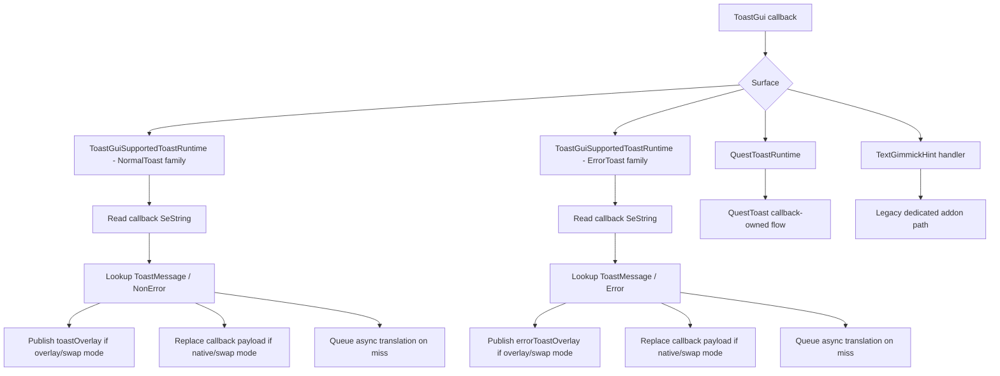

# ToastGui Runtime Alternative Path

This document describes the hidden full `ToastGui` path implemented on
`issue-188-minitalk-toast-reflow-followup`.

It exists as the parallel route for supported toasts while the legacy
addon-handler route remains available as the default fallback.

## Goal

Move the supported toast family toward the same callback-first shape already
used by quest toast:

- source capture starts at `ToastGui`
- translation lookup and queueing are runtime-owned
- overlay publication is runtime-owned
- native replacement is performed at the callback payload level
- supported addon handlers stop owning translation and native mutation while
  the hidden route is active

## Non-Goals

This route does not include:

- `_TextGimmickHint`
- `_MiniTalk`
- `BattleTalk`
- unrelated native layout work

`TextGimmickHint` remains explicitly outside this migration.

## Why This Route Exists

Quest toast already shows the cleanest toast flow in the plugin:

- source arrives early from `ToastGui`
- translation can be resolved before late node mutation is needed
- native replacement happens on the callback payload instead of by fighting a
  live addon tree after layout

The alternate supported-toast route tries to bring the rest of the supported
toast family closer to that model.

## Verified `ToastGui` Constraints From Dalamud

`ToastGui` exposes exactly these callback surfaces:

- `IToastGui.Toast`
- `IToastGui.QuestToast`
- `IToastGui.ErrorToast`

Important facts:

- normal toasts are intercepted through `UIModule.ShowWideText`
- quest toasts are intercepted through `UIModule.ShowText`
- error toasts are intercepted through `UIModule.ShowErrorText`
- `isHandled = true` prevents the original native call from running

The generic normal-toast callback exposes only:

- `SeString message`
- `ToastOptions.Position`
- `ToastOptions.Speed`

It does not expose:

- addon name
- subtype identity
- sheet row
- a stable marker that distinguishes `_WideText`, `_AreaText`, and
  `_TextClassChange`

That is why the alternate route deliberately treats those normal-toast
surfaces as one unified `Toast / NonError` family.

## Hidden Toggle

The full route is guarded by:

- `UseToastGuiRuntimeForSupportedToasts`

Current semantics:

- `false`
  - legacy addon-handler route remains active
  - optional prefetch-only `ToastGui` capture can still be used separately
- `true`
  - supported normal toasts use the callback-owned `ToastGui` family route
  - supported error toasts use the callback-owned `ToastGui` error route
  - legacy addon handlers for those supported families do not register
  - `TextGimmickHint` is unaffected

This toggle defaults to `false`.

## Supported Surfaces

### Included

Unified normal-toast family:

- `_WideText`
- `_AreaText`
- `_TextClassChange`

Dedicated error-toast family:

- `_TextError`

Already-callback-owned:

- quest toast

### Excluded

- `_TextGimmickHint`

## Design Decision: Treat Supported Normal Toasts As One Family

Under the hidden full route:

- `_WideText`, `_AreaText`, and `_TextClassChange` are treated as one logical
  `Toast / NonError` family
- the route does not try to preserve addon-specific ownership
- activation is not tied to those legacy addon identities
- behavior is not tied to those legacy addon identities

The plugin already matches this at the persistence level:

- those surfaces already live in `ToastMessage`
- with `ToastType = "NonError"`

## Current Implementation Shape

### Normal Toast Family

Runtime:

- [NativeUI/AddonHandlers/Toasts/ToastGuiSupportedToastRuntime.cs](/C:/Dante/_dalamud/Echoglossian/NativeUI/AddonHandlers/Toasts/ToastGuiSupportedToastRuntime.cs)

Policy:

- [NativeUI/AddonHandlers/Toasts/ToastGuiSupportedToastPolicy.cs](/C:/Dante/_dalamud/Echoglossian/NativeUI/AddonHandlers/Toasts/ToastGuiSupportedToastPolicy.cs)

Registration:

- [NativeUI/Helpers/ToastGuiSupportedToastRuntimeRegistration.cs](/C:/Dante/_dalamud/Echoglossian/NativeUI/Helpers/ToastGuiSupportedToastRuntimeRegistration.cs)

Current behavior:

1. `IToastGui.Toast` captures the source `SeString`.
2. The runtime looks up `ToastMessage` with `ToastType = "NonError"`.
3. Cache hits apply immediately:
   - overlay publication if needed
   - callback payload replacement if native/swap mode needs it
4. Cache misses queue translation asynchronously into `ToastMessage`.
5. The unified `toastOverlay` is synchronized to the viewport using
   `ToastOptions.Position`.

Current family-level display mode source:

- `WideTextToastTranslationDisplayMode`

That reuse is intentional and narrow. It gives the hidden route one stable
family-level display-mode setting without inventing a new public setting yet.

### Error Toast Family

Runtime:

- same `ToastGuiSupportedToastRuntime`

Current behavior:

1. `IToastGui.ErrorToast` captures the source `SeString`.
2. The runtime looks up `ToastMessage` with `ToastType = "Error"`.
3. Cache hits apply immediately:
   - overlay publication if needed
   - callback payload replacement if native/swap mode needs it
4. Cache misses queue translation asynchronously into `ToastMessage`.
5. `errorToastOverlay` is synchronized to a stable top-center viewport anchor.

### Quest Toast

Runtime:

- [NativeUI/AddonHandlers/Toasts/QuestToastRuntime.cs](/C:/Dante/_dalamud/Echoglossian/NativeUI/AddonHandlers/Toasts/QuestToastRuntime.cs)

This path is unchanged and remains the reference callback-owned route.

### `TextGimmickHint`

Runtime:

- [NativeUI/AddonHandlers/Toasts/TextGimmickHintHandler.cs](/C:/Dante/_dalamud/Echoglossian/NativeUI/AddonHandlers/Toasts/TextGimmickHintHandler.cs)

This path remains addon-owned and outside the migration.

## Flow Diagram

## Overlay and Swap Semantics That Must Be Preserved

The full route still respects the same stage separation:

1. capture
2. translation lookup or queue
3. overlay publication
4. native mutation

For the supported normal/error callback-owned route:

- overlay-only mode
  - do not mutate the callback payload
  - publish translated overlay text
- native mode
  - replace the callback payload with the translation
  - overlay may stay off
- swap mode
  - replace the callback payload with the translation
  - publish the original text in the overlay

The alternate route therefore keeps the same high-level user semantics while
changing who owns the stages.

## What Changes In Addon Registration

When the hidden full route is enabled:

- `_WideText` handler does not register
- `_AreaText` handler does not register
- `_TextClassChange` handler does not register
- `_TextError` handler does not register

That keeps ownership clean. The callback runtime is the translation owner, not
the addon handlers.

`TextGimmickHint` still registers normally.

## Why This Is Better Than Prefetch-Only

The older callback-assisted path only improved source timing. It still left:

- overlay publication
- native mutation
- late reflow/alignment problems

inside the addon-handler route.

The hidden full route removes that split ownership for supported normal and
error toasts.

## Known Constraint

### Cache-Miss Native Replacement

For callback-owned toasts, native replacement can only happen on a cache hit in
the current callback.

On a cache miss:

- translation is still queued and persisted
- overlay publication can still happen if the active mode uses overlays
- the toast that already passed through the callback cannot be rewritten
  natively afterward

This is an inherent callback limitation, not a plugin-specific quirk.

## Why `TextGimmickHint` Stays Out

`TextGimmickHint` is not exposed through `ToastGui` in a way that matches the
supported callback families, and it already has its own dedicated DB and
surface semantics.

Keeping it out avoids pretending it is part of the same runtime contract when
it is not.

## Migration Intent

This branch keeps both routes:

- legacy addon-handler route
- hidden full callback-owned `ToastGui` route

That lets the plugin compare behavior safely in-game before deciding whether
the callback-owned route should become the future default for supported toast
families.
